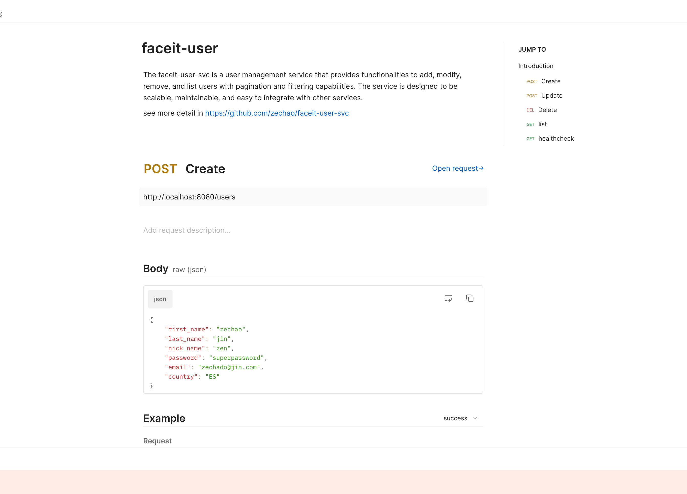
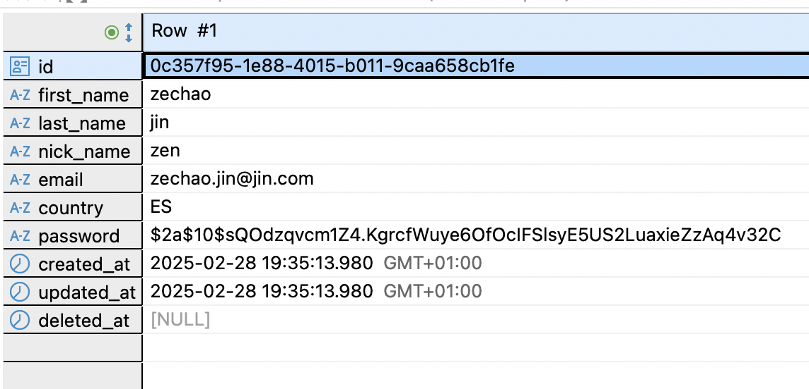
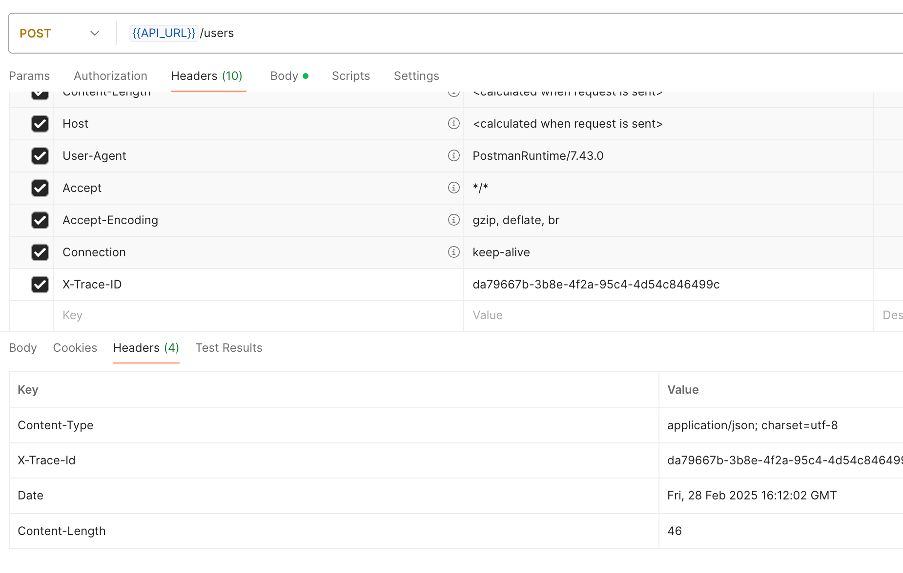

# faceit-user-svc

The [faceit-user-svc](https://github.com/zechao/faceit-user-svc) is a user management service that provides functionalities to add, modify, remove, and list users with pagination and filtering capabilities. The service is designed to be scalable, maintainable, and easy to integrate with other services.

## Quickstart
### Prerequisites

- Docker
- Docker Compose

### Running the Service
The project is containerized with all dependencies configured. 
To run the service in production mode, use the following command, which will set environment variables for the Docker containers:

```sh
docker-compose --env-file .env.production up -d --build
```

```sh
make run
```
or

```sh
docker-compose --env-file .env.production up -d --build
```


To run the service in development mode simply, it will load `.env` by default
```sh
make run-dev
```
or

```sh
docker-compose up -d --build
```

### Postman collection

You can import the provided Postman collection [`faceit-user.postman_collection.json`](faceit-user.postman_collection.json) to test the HTTP endpoints of the service. The collection includes all the necessary requests and examples to interact with the API. 

Once imported, you can run the requests and test the service endpoints. **Note: since I didn't add test data, if you run the example, you may get different error**
  <p align="center">
  
  <p/>


## Design requirements
The service must:
- [x] Provide an HTTP or gRPC API. **HTTP API implemented**
- [x] Use a sensible storage mechanism for the Users **Password hashed with bcrypt package, never return password in response**
- [x] Have the ability to notify other interested services of changes to User entities **Use NATS to notify other interested services**
- [x] Have meaningful logs **log with different level and trace ID**
- [x] Be well documented - a good balance between meaningful code documentation and
general documentation on your choices in a readme file **Detailed README**
- [x] Have a health check **Implement with endpoint `GET /health`**

## Project architecture 
The faceit-user-svc follows a modular, layered architecture designed with clean architecture principles to ensure separation of concerns, testability, and maintainability, all code is well tested.


### Architecture and design overview
The service is structured into several key components, all layer are interacted with interfaces, so dependencies are injected rather than created directly, facilitating testing and flexibility, so each component has a single responsibility, making the codebase easier to maintain.
As all bussiness logic are in service and domain layer, we can easily implement gRPC layer on it.

- **Domain Model** [user](user/): Defines core domain entities and business rules
- **API Layer** [http](http/): Handles HTTP requests, input validation, and response formatting
- **Service Layer** [service](service/): Contains business logic and orchestrates operations by calling repository for DB actions and send event to event handlers
- **Repository Layer** [repository](postgres): Manages data persistence and retrieval
- **Event System** [event](event/): Handles asynchronous communication
- **Query Handling** [query](query/): Manages filtering and pagination
- **Error Handling**: Centralized error handling [errors/errors.go](errors/errors.go) for consistent error responses.
- **Observability**: Built-in logging [log](log/) and tracing [tracing](tracing/) for monitoring and troubleshooting.
- **Database Migrations**: Structured migration system [migrations/migration.go](migrations/migration.go) for database schema evolution.
- **Configuration**: All configuration is read from system environment variables  [config](config/config.go). 


## Design details

### User Model Design
The User model contains all necessary fields and core business logic. Here, we only have the `HashPassword` method for simplicity, we can also add validation for
`User` model, but this case we validate in HTTP layer.

We use `gorm` as the database driver so we add `DeletedAt gorm.DeletedAt` to perform a soft delete, which sets a delete timestamp but still retains the record in the database. This is useful for systems that require the ability to restore deleted records. 

```go
type User struct {
    ID        uuid.UUID
    FirstName string
    LastName  string
    NickName  string
    Email     string
    Password  string
    Country   string
    CreatedAt time.Time
    UpdatedAt time.Time
    DeletedAt gorm.DeletedAt
}
```


### HTTP API Design
The service is designed to expose a RESTful HTTP API, providing endpoints for user management operations. The API is structured to ensure clarity, consistency, and security. While the current implementation focuses on an HTTP server, the architecture allows for the easy addition of a gRPC server if required in the future. 

Key principles:
- **Security**: Sensitive information, such as passwords, is never returned in API responses.
- **Consistency**: All endpoints follow RESTful conventions, ensuring predictable and intuitive interactions.
- **Scalability**: The API is designed to handle high loads and can be scaled horizontally.

Endpoints Overview
- **Create User**: `POST /users` - Adds a new user to the system.
- **Get User**: `GET /users/:id` - Retrieves user details by ID.
- **Update User**: `PATH /users/:id` - Updates user information.
- **Delete User**: `DELETE /users/:id` - Soft deletes a user.
- **List Users**: `GET /users` - Lists users with pagination and filtering options.

#### Add a new User
To add a new user endpoint. This endpoint requires all user data. Upon successful creation of the user, we have chosen to return the created user without the password. Here are the three approaches considered:

1. Return `status: 201` and an empty body, as the status code is sufficient to inform the client that the user was successfully created.
2. Return `status: 201` and only the UUID, as some systems may need this ID for further actions.
3. Return `status: 201` and the created user **without the password**, as shown in the example below:

What you see
```json
{
    "id": "0c357f95-1e88-4015-b011-9caa658cb1fe",
    "first_name": "zechao",
    "last_name": "jin",
    "nick_name": "zen",
    "email": "zechao.jin@jin.com",
    "country": "ES",
    "created_at": "2025-02-28T19:35:13.980913225Z",
    "updated_at": "2025-02-28T19:35:13.980913225Z"
}
```

What we have

  <p align="center">
  
  <p/>

#### Modify an existing User
In the REST API, updating a user can be done using either a full update (`PUT`) or a partial update (`PATCH`). A full update requires the client to send all user data, which is simpler to implement but can be inefficient as it involves sending potentially large amounts of data, including sensitive information, with every request. 

For this service, we have chosen to implement partial updates using the `PATCH` method. This approach minimizes traffic by allowing clients to send only the fields that need to be updated, reducing the risk of exposing sensitive information unnecessarily. 

Example of update request
```json
{
    "first_name": "zechao",
    "country": "CN"
}
```

Return status code `200` with following payload
```json
{
    "id": "a797919d-3cf1-47ff-9bf2-b0650cee9817",
    "first_name": "zechao",
    "last_name": "jin",
    "nick_name": "zen",
    "email": "zechado@jin.com",
    "country": "CN",
    "created_at": "2025-02-28T00:49:46.667718Z",
    "updated_at": "2025-02-28T00:59:55.891240731Z"
}
```

#### Remove a User
To remove a user, the service provides an endpoint that performs a soft delete, ensuring the operation is idempotent. This means that multiple requests to delete the same user will have the same effect as a single request. It always return status `200`, If the user is already deleted or does not exist, the response will still indicate success.


#### Return a paginated list of Users, allowing for filtering by certain criteria (e.g. all Users with the country "UK")

The list endpoint is designed to receive the following parameters. Multiple filters with multiple values can be added. If an unsupported query key is provided, a Bad Request error will be returned. Note that while the query parameter values are not validated in this implementation, such validation should be performed.

```go
type Query struct {
    Page     int
    PageSize int
    SortOrder string // Default value is "desc"
    SortBy string    // Default is "created_at"
    Filters map[string][]string // Allows multiple values per filter
}
```
Example of request, more example can be found in postman collection
```sh
/users?page=1&page_size=10&sort_by=first_name&sort_order=asc&country=ES&country=GB
```

We also return `total_records` in the response, which represents the total number of records matching the given filter. While calculating this value can be a performance issue, it can be mitigated by using a caching system like redis.
The response also contains requested or default parameters, with result and total records
```json
{
    "page": 1,
    "page_size": 10,
    "total_records": 2,
    "sort_by": "first_name",
    "sort_order": "asc",
    "filters": {
        "country": [
            "ES",
            "GB"
        ]
    },
    "data": [
        {
            "id": "c9d10cef-0766-49e6-9a19-e3508fdfb262",
            "first_name": "zechao",
            "last_name": "jin",
            "nick_name": "zen",
            "email": "zechado@jin.com",
            "country": "ES",
            "created_at": "2025-02-28T14:22:16.708974Z",
            "updated_at": "2025-02-28T14:22:16.708974Z"
        },
        {
            "id": "ef447c56-8a47-4dd0-85e4-e5393140066d",
            "first_name": "zechao",
            "last_name": "jin",
            "nick_name": "zen",
            "email": "zechao@jin.com",
            "country": "ES",
            "created_at": "2025-02-28T17:05:19.711301Z",
            "updated_at": "2025-02-28T17:05:19.711301Z"
        }
    ]
}
```


### Event System (Have the ability to notify other interested services of changes to User entities)
Our project includes an event system designed to notify other interested services of changes to User entities. This system is implemented using NATS, a lightweight and high-performance messaging system.

We create a topic named `user-svc` it can be configured in `.env` files.

We have 3 event type defined in [user.go](/user/user.go)
- UserCreated
- UserUpdated
- UserDeleted

The event payload can be any struct. **The best practice is to have a common repository to define event structures**, so other services can import from that repository. For simplicity, in this case, we return JSON with the user ID in payload.

Here is an example of an event when a user is created. Notice that we send a `trace_id` to track the request across microservices, an `event_type` to let services know the action performed, and a `timestamp` for ordering the event. 

```json
{
    "trace_id": "ff1378c3-9425-42f0-89b6-756ec226c684",
    "event_type": "UserCreated",
    "timestamp": 1740762319,
    "payload": "ef447c56-8a47-4dd0-85e4-e5393140066d"
}
```


In [main.go](/cmd/main.go) we define also a subscriber to simulate other service getting notified

```go
//Subscribe to the event bus to simulate another service
eventHandler.Subscribe(func(event event.Event) {
    data, err := json.Marshal(event)
    if err != nil {
        log.Printf("Failed to marshal event: %v", err)
    }
    log.Printf("Received event: %v", string(data))
})
// example of output
Received event: {"trace_id":"ff1378c3-9425-42f0-89b6-756ec226c684","event_type":"UserCreated","timestamp":1740762319,"payload":"ef447c56-8a47-4dd0-85e4-e5393140066d"}
```


### Observability
I defined `X-Trace-ID`, which will be sent by the client as a unique trace ID in the request Header. This ID will be propagated across the service using context. The purpose of this trace ID is to track the call throughout the service. If the client does not provide the `X-Trace-ID`, it will be generated in the middleware from [`tracing.go`](tracing/tracing.go). As you can see in the following image trace ID is set in the request and response header
  <p align="center">
  
  <p/>

In case we want to have gRPC endpoints, we have to implement `grpc interceptor` to handler this trace ID.
  
The log messages are structured to include key information such as timestamps, log levels, trace IDs, and contextual data to facilitate easy searching and filtering. Here is an example of a log message generated from a previous request that returned a "record already exists" error. **Note: User information is not logged to protect sensitive data.**

```json
{"time":"2025-02-28T16:12:02.643639136Z","level":"INFO","msg":"creating new user","user_id":"d297d011-84bc-4a01-a4b0-2b1e412c59e2","trace_id":"da79667b-3b8e-4f2a-95c4-4d54c846499c"}
{"time":"2025-02-28T16:12:02.738414397Z","level":"WARN","msg":"service error","error":"record already exists","trace_id":"da79667b-3b8e-4f2a-95c4-4d54c846499c"}
{"time":"2025-02-28T16:12:02.73850743Z","level":"INFO","msg":"HTTP REQUEST","status_code":409,"duration":96939071,"client_ip":"192.168.65.1","method":"POST","path":"/users","raw":"","response_size":46,"trace_id":"da79667b-3b8e-4f2a-95c4-4d54c846499c"}
```

### Database
We use PostgreSQL as our primary storage system, but the service is designed to support any type of database by abstracting the data access layer. This allows for easy switching or integration with other databases if needed. Additionally, we support database migrations for schema evolution, ensuring that changes to the database schema can be applied consistently and reliably across different environments.

To create a new migration, use the following command:

```sh
make migration-create name=<name_of_the_migration>
```

Note: Indexes are not created for the user table by default. However, adding indexes is crucial for improving database performance and should be considered based on your specific query patterns and performance requirements.


### Configuration
 All configurations are read from system environment variables, here for simplicity we save those variables in `.env*` file, which will be loaded by our app or docker compose.

 However, in real-life microservices, it is recommended to use a configuration management system or service such as Consul, etcd, or AWS Systems Manager Parameter Store. These tools provide centralized management, versioning, and secure storage of configuration data, which enhances the scalability, maintainability, and security of your microservices.

## Q&A
### How have you structured your application, and what implications does this have on future feature requests?

The application is structured using a modular, layered architecture following clean architecture principles. This ensures separation of concerns, testability, and maintainability.

Implications for Future Feature Requests
- Scalability: The modular design allows for easy scaling of individual components.
- Maintainability: Separation of concerns ensures that changes in one module do not affect others.
- Testability: Dependency injection and interface-based design facilitate unit testing.
- Flexibility: New features can be added with minimal impact on existing code.
- Extensibility: The architecture supports adding new interfaces like gRPC without major refactoring.

### How would your solution react in a distributed environment with high throughput traffic?
- Horizontal scalable
- Caching: Implementing caching mechanisms, such as Redis, List endpoint its a good point to improve
- Database Optimization: Using efficient database queries, indexing, and connection pooling can help manage high throughput traffic

### How is your code following Go idioms?
- Dependencies are injected rather than created directly 
- The use of context for request-scoped values like trace IDs, as seen in the tracing package, is a common Go practice for managing request life cycles.
- The use of an event system with NATS for asynchronous communication is a Go idiom for building scalable microservices.
- testing using table testing

### How would you expand the solution if you had more time?
- Improve the update user functionality by using unique queries or transactions to prevent race conditions.
- Add Linting using `golangci-lint` and solve lint issues
- Improve current test, add more test case and add `e2e` test
- Add dummy data for testing [gofakeit](https://github.com/brianvoe/gofakeit)
- Add Load test
- Add API documentation using Swag (https://github.com/swaggo/swag)
- CI/CD pipeline that check code and push them to cloud enviroment using Git Action
- Implementing cache system
- Add rate limiting to protect the service from being overwhelmed 
- Add configuration management system 
- Improve the observability of the service by adding more detailed logging depends on the configuration